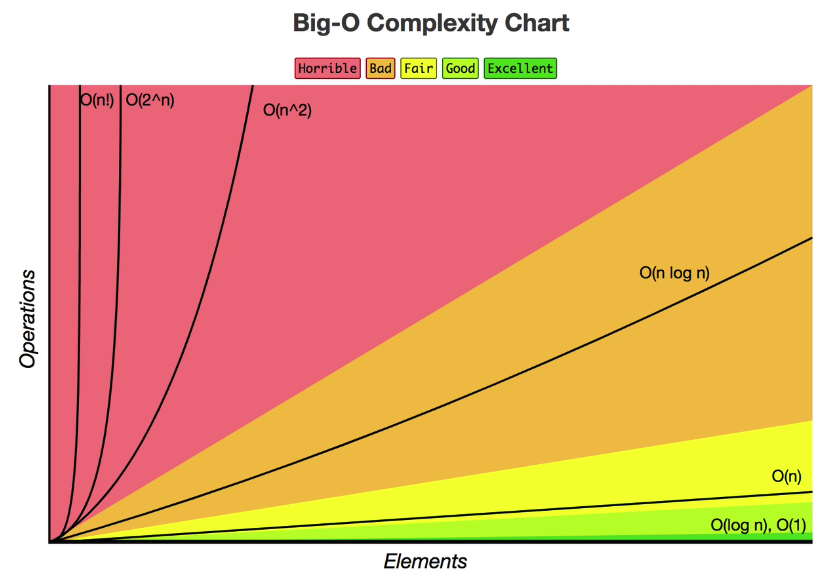

<h1>Trees</h1>

There as many types of trees structrues, Linked list is a type of tree, with only one direction. Each one for a specific usecase.

<h2>Base Structure</h2>
<ul>
<li>Root</li>
<li>Parent</li>
<li>Child</li>
<li>Leat</li>
<li>Sibling</li>
</ul>

<h2>O Complexity</h2>

Trees performance to lookup, insert and delet in worst case is O(Log N) when the tree is balanced, insted of that, the performance in works case is O(n).

<h2>Types</h2>
<h3>Binary Tree</h3>

Is goood to search, this data structure preserve relationships, this is good to make a preservation of folders(for example).

<ul>
  <li><a href="https://visualgo.net/en/bst">Nice site to visualize how Binary Search Tree (BST) works</a></li>
</ul>

Each node only can have 0, 1 or 2 nodes and each child can have only 1 parent.

<h4>Binary Tree: Performance in worst case</h4>

Each interaction(height) you only need to chose one node.

<ul>
  <li>lookup: O(log N)</li>
  <li>insert: O(log N)</li>
  <li>delete: O(log N)</li>
</ul>

<h4>Binary Tree: Characteristics</h4>

<ul>
  <li>The left node value < currentNode</li>
  <li>The right node value > currentNode</li>
</ul>

<h4>Pros vs cons</h4>
<ul>
  <li>Pro: Better than O(n)</li>
  <li>Pro: Ordered</li>
  <li>Pro: Flexible Size</li>
  <li>Cons: There is no O(1) operations</li>
</ul>

